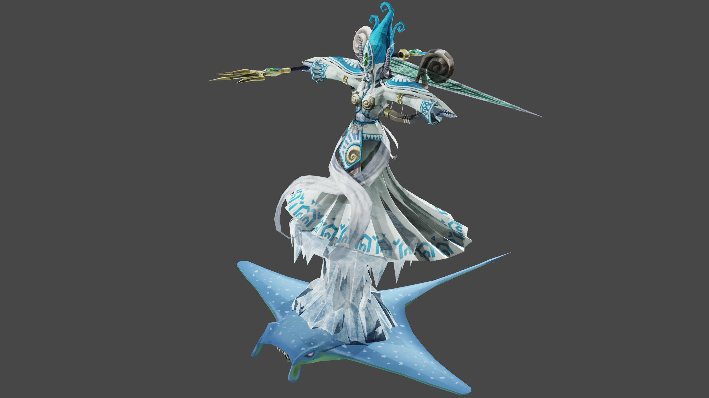

# Eye of Judgement reverse

A small reverse engineering puzzle I started toying with for fun. This code is from an earlier point in time and cleaned
up. It only extracts certain parts of one specific model using hardcoded positions and some hacky 'heuristics'. It 
partially uses Kaitai for the implementation, because I wanted to try it out.

This sample code extracts the mesh data and texture, the global joint pose and some XML documents containing
various effect configurations (like particle effects).

Model:

Joints:

Locally, I have figured out more about the general format, so I can more directly parse everything. A screenshot which
was made at a later point in time (though there are still some errors):

TODO:
* be able to parse all models without error
* extract the animations
* extract other effects? sounds?
* -insert other features-